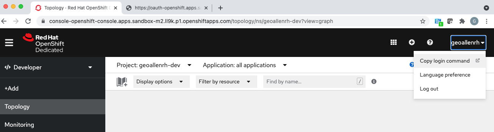
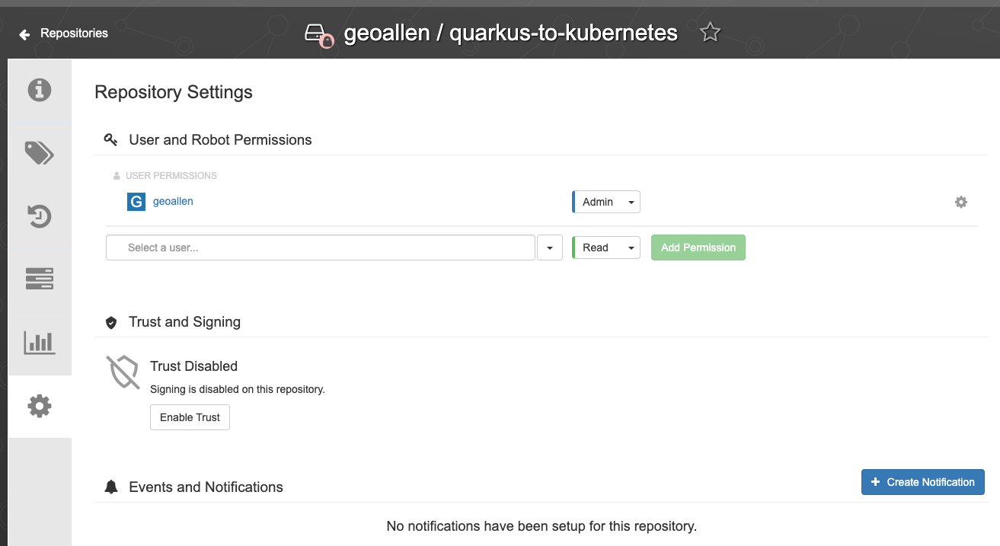
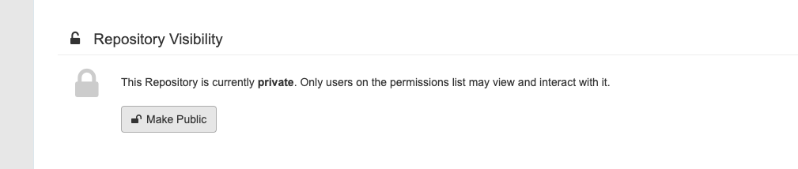
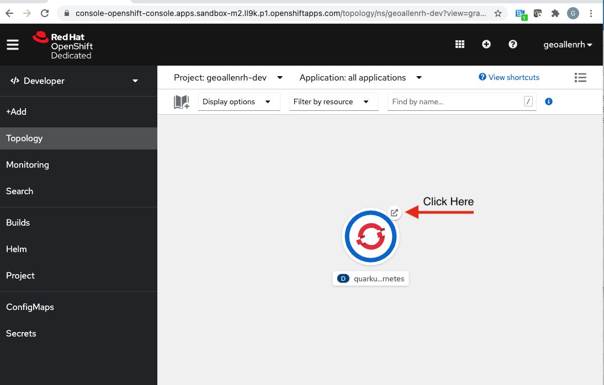

# Table of Contents
- [Background](#background)
- [Additional Resources](#additional-resources)
- [Prerequisites](#prerequisites)
- [Quarkus to Kubernetes](#quarkus-to-kubernetes)
- [Quarkus to OpenShift](#quarkus-to-openshift)

# Background
Hands-on tutorial that demonstrates the abilty to deploy Quarkus applications to Kubernetes and OpenShift clusters.

The completed solution to this exercise can be found in this repo's `solution` branch. 

# Additional Resources
- [Deploying to Kubernetes](https://quarkus.io/guides/deploying-to-kubernetes)
- [Deploying to OpenShift](https://quarkus.io/guides/deploying-to-openshift)
- [Red Hat OpenShift Developer Sandbox](https://developers.redhat.com/developer-sandbox/get-started)

# Prerequisites
- A Java 11 runtime
- Docker runtime
- Access to the internet
- Apache Maven 
- Container Registry - (Example uses Quay.io)
- Kubernetes and/or OpenShift Cluster - We will use the Developer Sandbox for Red Hat OpenShift 
- https://developers.redhat.com/developer-sandbox/get-started

# Quarkus to Kubernetes 

Under the hood, this demo uses:

- RESTEasy to expose the REST endpoints
- REST-assured and JUnit 5 for endpoint testing
- Container Image Docker
- Kubernetes Extension

1. Authenticate with Developer Sandbox

Obtain OpenShift login token from console.



Document the url and the Project name. You will need this for the configuration

2. Login to your Container Registry 
```
docker login quay.io
```

3. Create the sample application 
```
mvn io.quarkus.platform:quarkus-maven-plugin:2.2.2.Final:create \
    -DprojectGroupId=org.acme \
    -DprojectArtifactId=quarkus-to-kubernetes \
    -DclassName="org.acme.rest.GreetingResource" \
    -Dpath="/greeting" \
    -Dextensions="resteasy,kubernetes,container-image-docker"
cd quarkus-to-kubernetes
```

4. Add configuration to ./src/main/resources/application.properties
```
quarkus.container-image.registry=quay.io
# If your quay.io username is different from your local OS's username, specify your quay.io username here
# quarkus.container-image.group=my_quay_username
quarkus.container-image.builder=docker
quarkus.kubernetes.ingress.expose=true
#quarkus.kubernetes.ingress.host=quarkus-to-openshift-geoallenrh-dev.apps.sandbox-m2.ll9k.p1.openshiftapps.com
#Update with your values.  The Host-Name is typically your component name and project/namespace.  Then add the rest of the URL as the example above.
quarkus.kubernetes.ingress.host=<HOST-NAME>.<REMAINDER-OF-URL-FROM-SANDBOX-CLUSTER>

#These values allow you to interact with the server without kubectl or oc installed
quarkus.kubernetes-client.master-url=<API-SERVER>
quarkus.kubernetes-client.username=<Your-RedHat-UserID>
quarkus.kubernetes-client.token=<The Token from the Login Command>

#This is the Openshift Project documented earlier
quarkus.kubernetes-client.namespace=<USERID>-dev
```

5. Test Application

```
 ./mvnw quarkus:dev
 ```

This command will leave Quarkus running in the foreground listening on port 8080.

Visit the default endpoint: http://127.0.0.1:8080

Visit the `/greeting` endpoint: http://127.0.0.1:8080/greeting


# Deploying to Kubernetes 
Quarkus offers the ability to automatically generate Kubernetes resources based on sane defaults and user-supplied configuration using https://github.com/dekorateio/dekorate/.

Furthermore, Quarkus can deploy the application to a target Kubernetes cluster by applying the generated manifests to the target cluster's API Server.

For example, following the execution of `./mvnw package`, you will notice amongst the other files that are created, two files named
`kubernetes.json` and `kubernetes.yml` in the `target/kubernetes/` directory.

If you look at either file you will see that it contains both a Kubernetes `Deployment` and a `Service`.

1. Packaging the application and build the Container Image
```
./mvnw clean package -DskipTests -Dquarkus.container-image.build=true
```
2. Pushing the Image to Repository
```
./mvnw clean package -DskipTests -Dquarkus.container-image.push=true
```
3. Make Container Repository Public
In Quay.io, the repository is private by default.



Make Repository Public (Just to make things simpler.  We can create and use Pull Secrets)



4. Deploy Applications
```
./mvnw clean package -DskipTests -Dquarkus.kubernetes.deploy=true
```

5. Open OpenShift Console




# Quarkus to OpenShift 

1. Authenticate with Developer Sandbox

Obtain OpenShift login token from console.


2. Create the sample application 

```
mvn io.quarkus.platform:quarkus-maven-plugin:2.2.2.Final:create \
    -DprojectGroupId=org.acme \
    -DprojectArtifactId=quarkus-to-openshift \
    -DclassName="org.acme.rest.GreetingResource" \
    -Dpath="/greeting" \
    -Dextensions="resteasy,openshift"
cd quarkus-to-openshift
```

3. Add configuration to ./src/main/resources/application.properties

```
#These values allow you to interact with the server without kubectl or oc installed
quarkus.kubernetes-client.master-url=<API-SERVER>
quarkus.kubernetes-client.username=<Your-RedHat-UserID>
quarkus.kubernetes-client.token=<The Token from the Login Command>
quarkus.kubernetes-client.namespace=<USERID>-dev
quarkus.openshift.route.expose=true

```

4. Deploy to OpenShift
```
./mvnw clean package -DskipTests -Dquarkus.kubernetes.deploy=true
```

The aforementioned command will build a jar file locally, trigger a container image build and then apply the generated OpenShift resources.

The generated resources are using OpenShift's `DeploymentConfig` that is configured to automatically trigger a redeployment when a change in the `ImageStream` is noticed.
In other words, any container image build after the initial deployment will automatically trigger redeployment, without the need to delete, update or re-apply the generated resources.


5. Open OpenShift Console


